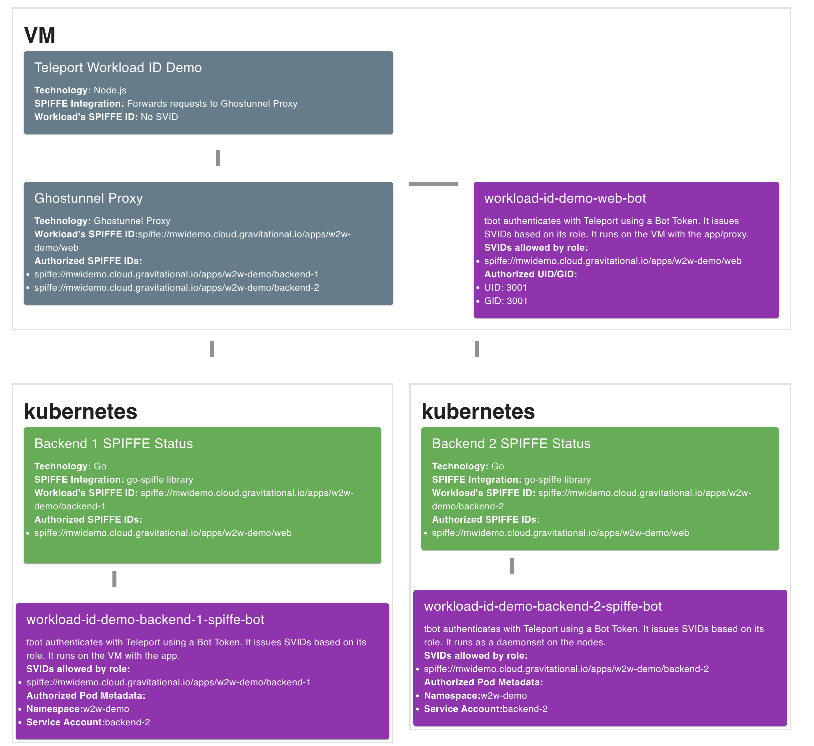

# Workload ID Demo
Demo infrastructure and applications of Teleport Workload ID

## Overview

The demo consists of four core components:
* A Node app that has no inherent SPIFFE support, which calls to
* A [Ghostunnel](https://github.com/ghostunnel/ghostunnel) proxy instance running in client mode, which calls to
* Two backends, written in Go, using the `go-spiffe` SDK
* `tbot` instances that provide SVIDs for Ghostunnel and the backend app

The Node app and Ghostunnel are deployed to a VM together,
Backend 1 is deployed to its own VM, and Backend 2 is deployed to Kubernetes.

By using mutually verifying SPIFFE IDs, the two apps communicate via mTLS wit
guaranteed mutual identity.

### Accessing the Demo

The [live demo page](https://w2w-demo.mwidemo.cloud.gravitational.io/) is protected via Teleport App Access. You need access to the
demo Teleport cluster running at https://mwidemo.cloud.gravitational.io.
If you are a Teleport employee, please reach out to Dave for access.

## Components

### Backend 1 & 2

The [backend app](./backend/main.go) is fairly simple. It is a go HTTP(S) server
that uses the `spiffe-go` library to communicate with the workload API. It takes
a socket to reach the API on, and a SPIFFE ID that it should authenticate before
accepting traffic. It returns its name, what kind of infrastructure it is running on,
its own SPIFFE ID, and what IDs it verifies.

The goal with this code is that it can be deployed more times in other infrastructure,
easily expanding the demo. See [Future Improvements](#future-improvements) below.

Right now both backends are running in a Kubernetes cluster, with their SVID validated by their namespace and service account.

### Web

The [web app](./web/index.js) serves up a visualization of the system, shown by the
screenshot at the beginning of the README. If it cannot communicate with a given backend,
it turns the card for that backend red and displays the error, otherwise the card is green
and displays the metadata returned from the backend. It requires Ghostunnel to communicate
with the backend.

## Deployment as MWI Demo

The `deploy` action uses many features of Teleport Machine & Workload Identity to keep static, long-lived secrets out of the process.

Both the web and backend apps are deployed in containers. These container builds are pushed to an AWS ECR registry, which would normally require an AWS keypair. Here we use MWI's SPIFFE certificate capability and AWS Roles Anywhere to generate a short-lived certificate that can be traded for an AWS Role that allows management of that registry only.

Then in the deploy phase we use ssh and kubernetes configs output by Teleport to securely deploy all the components of the app through Teleport's secure proxy, with a comprehensive audit log. The Ansible playbooks deploying `ghostunnel` and `web` run via SSH through the proxy, and the backend is deployed to the kubernetes clusters via `helm` through the proxy.

## Development

There is a [testing](./testing) directory with several helper scripts. To
develop locally, you must have the ability to create bots within the
Teleport cluster. Have multiple terminal windows open, and, from the
testing directory, run the following commands across them to do local development:
1. `$ sudo ./create-backend-bot.sh`
1. `$ sudo ./create-web-bot.sh`
1. `$ sudo ./start-ghostunnel.sh`
1. `$ sudo ./start-backend.sh`
1. In the web directory, run `$ npm run dev`

## Future Improvements

The main improvement I want to make is showing more attestation methods. Running a backend on a VM using Docker/Podman labels, and using pod labels in Kubernetes rather than just a service account are two specific examples.
